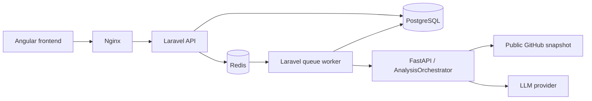

# Architecture overview

Status: accepted Phase 0 design, 2026-09-28. The analysis flow and domain contracts below remain planned. B02 adds the local topology; B03 implements the relational API and B04 reliable queue handoff/authenticated internal boundary. B05–B09 add separately callable RepositoryReader, FileSelector, ContextBuilder, bounded LLMClient and FindingValidator components; finding validation is implemented independently in B09; B10 integrates the fixed pipeline with the authenticated endpoint; see [local setup](../development/local-stack.md). See the [ADRs](adr/README.md) for rationale and the [backlog](../planning/mvp-0.1-backlog.md) for implementation gates.

[B01 implementation contracts v1](../contracts/README.md) refine the planning targets below with exact envelopes, lifecycle rules and initial finite limits. Use them for implementation; the accepted architectural decisions remain unchanged.

## Scope and boundaries

MVP 0.1 analyzes a bounded snapshot of a public GitHub repository and returns advisory technical findings with source evidence. It has one deterministic orchestration path around an LLM call, with no autonomous tool loop. Private repositories, code execution, repository writes, automated fixes, RAG, agent frameworks, multiple agents, and MCP are excluded.

Nginx serves the frontend and forwards `/api` to Laravel. Only Nginx is intended to be externally reachable. Laravel owns application state, authorization, lifecycle transitions, and all database writes. Redis carries Laravel jobs, not authoritative results. The worker calls the internal FastAPI service; the browser never calls it directly. FastAPI has no database credentials and returns a validated result envelope to the worker.

Compose will define Nginx, frontend build/serving assets, Laravel API, Laravel worker, FastAPI, PostgreSQL with pgvector available, and Redis. API and worker share an application image but have separate processes. PostgreSQL uses durable storage; repository workspaces are ephemeral. Internal services are not published on host ports by default. Secrets are injected at runtime, excluded from Git, and never included in prompts or logs. Compose is the initial local integration environment; production deployment and scaling are separate decisions.

## End-to-end flow

1. Angular submits a canonical public repository URL to Laravel with an idempotency key.
2. Laravel validates the URL, enforces request limits, stores an analysis with status `queued`, and returns its ID with HTTP 202. Duplicate submissions with the same key and body return the existing ID; a changed body conflicts.
3. A Laravel job claims the analysis, sets `running`, and calls FastAPI with an analysis ID, attempt ID, repository identity, and server-controlled limits. A reconciliation job recovers queued rows whose queue publication failed.
4. `AnalysisOrchestrator` invokes `RepositoryReader` to resolve the default branch to an immutable commit SHA and fetch a bounded snapshot. The SHA is persisted through Laravel when the result or error envelope returns; retries for that attempt reuse the SHA once resolved. A retry that cannot recover the resolved SHA is a new attempt, and its provenance must be recorded separately.
5. `FileSelector` inventories the snapshot and selects eligible text files under explicit rules and budgets.
6. `ContextBuilder` produces a bounded prompt context with relative paths, line numbers, omitted-file reasons, and deterministic selection order.
7. `LLMClient` requests findings under a versioned JSON contract from one configured provider/model. It has no repository execution or tool-calling capability.
8. `FindingValidator` checks structure, enums, counts, evidence paths and line ranges against the supplied context. The service returns validated findings and provenance or a structured failure.
9. Laravel validates the envelope again, checks the active attempt, and atomically persists findings and marks the analysis `completed`. Failures become `failed` with a safe error code. Duplicate or stale responses cannot duplicate findings or overwrite a newer attempt.
10. Angular polls the Laravel status/results endpoints and displays findings, evidence, source revision, coverage limitations, and failure states.

For 0.1 the internal FastAPI call is synchronous inside the asynchronous Laravel job. Set an overall AI deadline, a longer worker HTTP timeout, a longer job timeout, and a still longer Redis reservation interval. Bound each underlying network operation and propagate cancellation/deadline checks through the pipeline. Retry transient transport/provider failures a small configured number of times with backoff; validation failures and policy violations are terminal. Expired running attempts are marked failed by reconciliation. This simple design can repeat an LLM call after a lost response; costs are bounded by attempt limits, while persistence remains idempotent. Separate AI job infrastructure is deferred until measured need.

## Explicit AI components

| Component | Input → output | Boundary |
| --- | --- | --- |
| `AnalysisOrchestrator` | Analysis request → result/error envelope | Coordinates stages, deadlines, cleanup, provenance; no hidden agent loop |
| `RepositoryReader` | Canonical repository identity and optional SHA → snapshot + manifest | Public GitHub network access only; bounded, read-only acquisition |
| `FileSelector` | Manifest + selection policy → selected files + exclusion report | Pure selection; ignores binary, generated, vendored and sensitive paths |
| `ContextBuilder` | Selected text + token budget → labeled context + evidence map | Preserves source locations; truncation is explicit |
| `LLMClient` | Prompt/context + output schema → candidate JSON + usage metadata | Platform-owned interface with provider details behind an adapter; bounded timeout/retries; no tools |
| `FindingValidator` | Candidate JSON + evidence map → validated findings or errors | Rejects unsupported evidence and malformed payloads; cannot establish semantic truth |

Use ordinary interfaces and typed request/result objects. The pipeline depends on the platform-owned `LLMClient` interface, not a provider SDK. Implement one real provider adapter and a fake adapter for deterministic tests; keep provider-specific request/response details inside the adapter and the core finding contract provider-independent ([ADR 0007](adr/0007-llm-provider-abstraction.md)). Inject provider and repository adapters so tests can use fixtures and a fake LLM. Do not introduce a general plugin registry, agent framework, or workflow engine in 0.1.

## Proposed API and data contracts

The contracts below are planning targets. Implementation must publish matching OpenAPI definitions and validate all boundary payloads.

- `POST /api/analyses`: `{repository_url}` with `Idempotency-Key`; returns `{id, status}`. Accept only `https://github.com/{owner}/{repo}` (optional `.git` or trailing slash), without credentials, query, fragment, extra path segments, or custom ports. Canonicalize before persistence.
- `GET /api/analyses/{id}`: state, repository, SHA when available, timestamps, coverage summary, and safe error metadata.
- `GET /api/analyses/{id}/findings`: paginated findings for a completed analysis; before completion return an explicit not-ready response, not misleading empty results.
- Internal `POST /internal/v1/analyses:run`: `{schema_version, analysis_id, attempt_id, repository, commit_sha?, limits}` → result/error envelope. Authenticate using a runtime secret over the internal network; public routing must not expose this endpoint.

An analysis follows `queued → running → completed | failed`. Retrying a failed analysis creates a new attempt and transitions it back to `queued`; completed results are immutable. Atomic state checks prevent simultaneous active attempts. In 0.1, only a controlled operator action retries terminal failures; a user-facing retry API is deferred.

Planned relational records:

- **analyses**: ID, canonical repository identity, idempotency key and request hash, status, active attempt ID, timestamps, safe failure code.
- **analysis_attempts**: ID, analysis ID, attempt number, status/timestamps, resolved SHA, prompt/schema/selection-policy versions, model/provider, usage, stage timings, coverage summary, safe error code. Never persist full prompts or raw repository content by default.
- **findings**: ID, analysis ID, successful attempt ID, category, severity, title, explanation, recommendation, evidence JSON, optional confidence. Unique result identity per attempt prevents duplicate insertion.

A version-1 finding contains `category` (`architecture`, `maintainability`, `reliability`, `security`, or `testing`), `severity` (`info`, `low`, `medium`, `high`, or `critical`), bounded plain-text `title`, `explanation`, `recommendation`, and at least one evidence entry `{path, start_line, end_line}`. Optional confidence is numeric in [0,1] and is not a calibrated probability. All evidence must refer to selected context lines from the recorded SHA. Reject unknown fields, invalid ranges, unsupported enums, excessive text/counts, and invalid JSON. A valid empty findings array means no findings in the inspected context, not a guarantee of quality. If any finding is invalid, fail the candidate response as a whole; partial persistence is excluded in 0.1.

The envelope includes schema version, analysis/attempt IDs, resolved SHA, findings, coverage/exclusions, model and prompt provenance, and usage. Error envelopes carry stage and safe code, plus SHA/provenance if already known. Laravel applies application-owned IDs rather than trusting model-generated identifiers. Findings and the successful terminal transition are committed in one transaction.

pgvector is part of the selected storage platform but no vector tables, embeddings, indexing, or retrieval are required until 0.2.

## Untrusted repository handling

- Validate URLs in Laravel and again in the reader. Fetch only from fixed GitHub API/archive hosts through an allowlisted adapter. Validate redirects and resolved addresses, block private/loopback/link-local destinations, and restrict outbound traffic. Never fetch arbitrary URLs found in source files.
- Resolve a public repository to a SHA, then acquire that snapshot without a writable checkout or push credentials. Do not recurse into submodules or retrieve Git LFS objects in 0.1. Record these omissions.
- Before and during extraction enforce compressed/decompressed byte, file-count, path-depth, per-file size, and elapsed-time limits. Reject traversal, absolute paths, links and special files; ensure every destination stays inside the attempt workspace. Never trust archive metadata alone.
- Run with a non-root user, restricted filesystem permissions, CPU/memory/disk limits, isolated temporary directories, and cleanup in success/failure paths plus stale-workspace cleanup. Acquisition may write temporary files; read-only refers to repository access and subsequent inspection, not absence of local storage.
- Never invoke repository scripts, package managers, builds, tests, hooks, executables, or language tooling that loads project configuration or plugins. Repository instructions, including `AGENTS.md`, are analysis data and cannot change system policy.
- Exclude likely secrets and sensitive files with explicit path/content rules. This filtering is imperfect: show users that selected public source will be sent to the configured LLM provider. Choose provider data-use and retention settings in B08 before sending source; establish and tune local result retention/deletion in B12.
- Delimit repository text as untrusted context. Prompt instructions cannot authorize tools, network calls, policy changes, or secret access. Validate output independently and render findings as escaped text; do not render raw model HTML.
- Record inspected versus omitted files, limits reached, and analysis limitations. Evidence validation establishes source references, not factual correctness; users must assess findings.

Limits must be finite, server controlled, and tested at their boundaries before real acquisition is enabled. Oversized snapshots fail safely; context selection may omit eligible files within the configured token budget, reporting coverage explicitly.

## Access, observability, and outstanding decisions

The 0.1 integration target is a single-operator local environment bound to loopback. Authentication and multitenant authorization are not implemented by this design; public deployment is blocked until a separate access-control decision and abuse controls are implemented. Submission rate, concurrency, token, and cost limits still apply locally.

Baseline operational visibility belongs in 0.1: correlation IDs, per-stage duration, safe error codes, queue age, provider usage, and workspace cleanup failures. Logs exclude prompts, source, secrets, and raw model responses. Basic evaluation starts in MVP 0.1 with deterministic fixtures, fake LLM responses, schema validation, evidence validation, basic regression tests, and representative success/failure cases. Release 0.7 expands this into larger benchmark datasets, systematic quality/regression gates, cost and latency analysis, distributed tracing, and more mature evaluation infrastructure; essential contract/security checks are required from 0.1.

B08 selects a pinned OpenAI adapter, standard data policy and local monetary ceilings; real calls remain disabled by default. See [B08 policy and validation](../development/b08-validation.md) for disclosure, configuration and simulated checks.

B01 gates implementation only on the analysis lifecycle, findings schema, application and internal request/result contracts, initial conservative finite resource limits, and loopback-only scope. Refine GitHub quota handling during B05, provider/model selection, data handling and operational tuning during B08, and local result retention/deletion during B12. Set bounded cost budgets and provider data-use/retention settings before real-provider calls in B08, then refine detailed budgets empirically. Initial limits remain enforced throughout; these later decisions do not block starting implementation. UI language, production hosting, user identity, and broader deployment remain later product decisions.
